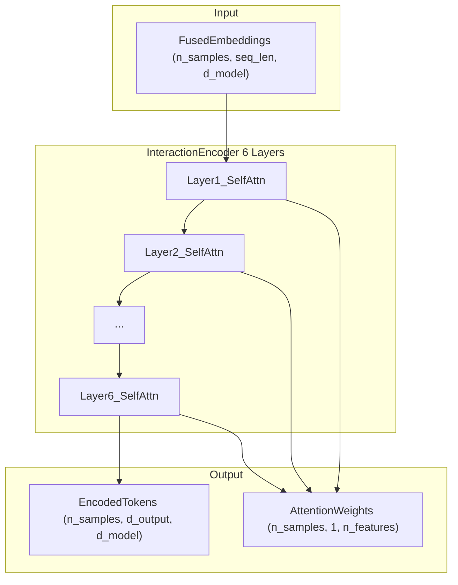

# TabStar Explainability

This directory contains extensions to the TabStar model, including explainability tools.

## Explainability Module (`explainability.py`)

Attention-based explainability that extracts feature importance from TabStar's InteractionEncoder (6-layer Transformer). Analyzes which features influence predictions by examining attention weights across layers.

### Overview

TabStar's InteractionEncoder is a 6-layer Transformer that models cross-column interactions. The attention weights reveal which features (columns) influence predictions the most.



### Key Components

| Class | Description |
|-------|-------------|
| `AttentionCapturingEncoderLayer` | Custom transformer layer that returns attention weights |
| `ExplainableInteractionEncoder` | Modified encoder that captures attention from all 6 layers |
| `TabStarExplainer` | Main class for computing and visualizing feature importance |
| `LocalExplanation` | Per-sample importance scores |
| `GlobalExplanation` | Dataset-wide aggregated importance |

### Installation

The module is part of the tabstar_extensions package. No additional installation required.

```python
from tabstar_extensions.explainability import TabStarExplainer, explain_tabstar
```

### Quick Start

```python
# After training your TabSTARClassifier/Regressor
explainer = TabStarExplainer(tabstar)

# Global importance (dataset-wide)
global_imp = explainer.explain_global(X_test)

# Local importance (per-sample)
local_imp = explainer.explain_local(X_test)

# Visualizations
explainer.plot_feature_importance(global_imp, top_k=10)
explainer.plot_attention_heatmap(X_test, sample_idx=0, layer_idx=-1)
explainer.plot_importance_distribution(local_imp, top_k=10)
```
example ranked feature importance for the IMDB dataset. A TabSTAR classifier is trained to predict (Genre_is_Drama) from following features: 


```python
# Comparing Aggregation Methods
for agg in ['mean', 'last', 'rollout', 'weighted']:
    explainer = TabStarExplainer(tabstar, aggregation=agg)
    global_imp = explainer.explain_global(X_test)
    print(f"\n{agg.upper()} aggregation:")
    for name, imp in sorted(global_imp.to_dict().items(), key=lambda x: -x[1])[:5]:
        print(f"  {name}: {imp:.4f}")
```

### API Reference

#### `TabStarExplainer`

```python
explainer = TabStarExplainer(
    model,                    # TabSTARClassifier/Regressor (auto-extracts preprocessor)
    preprocessor=None,        # Optional if passing Classifier/Regressor
    aggregation='mean',       # 'mean', 'last', 'rollout', or 'weighted'
    device=None               # Auto-detected if None
)
```

**Aggregation methods:**
- `mean`: Average across all layers/heads (default)
- `last`: Last layer only (most task-specific)
- `rollout`: Multiply attention matrices across layers
- `weighted`: Higher weight on later layers

#### `explain_global(X)`

Compute dataset-wide feature importance.

```python
global_imp = explainer.explain_global(X_test)

# Returns GlobalExplanation with:
global_imp.feature_names  # List of column names
global_imp.importance     # np.array of shape (n_features,)
global_imp.std            # np.array of standard deviation across samples
global_imp.to_dict()      # Dict mapping feature names to importance
```

#### `explain_local(X)`

Compute per-sample feature importance.

```python
local_imp = explainer.explain_local(X_test)

# Returns LocalExplanation with:
local_imp.feature_names   # List of column names
local_imp.importance      # np.array of shape (n_samples, n_features)
local_imp.attention_weights  # Optional raw attention (if return_attention=True)
```

### How It Works

1. **Extract Attention**: Run input through the model and capture attention weights from all 6 transformer layers (InteractionEncoder)
2. **Aggregate Attention**: Combine attention across layers and heads using the selected aggregation method
3. **Target-to-Feature Attention**: Extract attention from target tokens to feature columns, then average across target tokens to get the importance for each feature.
   - Sequence structure: `[target_tokens] + [n_features]`
   - Importance = how much prediction is influenced by each feature, importance is computed for feature columns, with constant columns receiving zero importance.

4. **Normalize**: Scale importance values to sum to 1 per sample, and average across samples to get the dataset-wide global importance.


#### Attention Heatmap Analysis

```python
# Visualize full attention matrix for a sample
explainer.plot_attention_heatmap(
    X_test,
    sample_idx=0,
    layer_idx=-1,    # Last layer
    head_idx=None    # Average across heads
)
```

### Handling Constant Columns

Columns with constant values (no variance) are:
- Excluded from model training by the preprocessor
- Included in feature importance with **zero importance**
- Displayed at the bottom of importance charts

```python
# Constant columns are automatically handled
global_imp = explainer.explain_global(X_test)
# constant_col will have importance = 0.0
```

### Limitations

- Attention-based explanations show correlation, not causation
- Importance values are relative within a sample/dataset
- Works best with models that have learned meaningful attention patterns, 
  in this case the pretrained+fine-tuned E5 encoder as input, and the learned InteractionEncoder for cross-column interactions
- For textual features, it's impossible to do permutation importance, because the text token sequence are not differentiable.

### Related Files

- `../src/tabstar/tabstar_model.py`: TabSTAR model class
- `../src/tabstar/arch/interaction.py`: Original InteractionEncoder
- `../src/tabstar/arch/fusion.py`: Numerical fusion module
